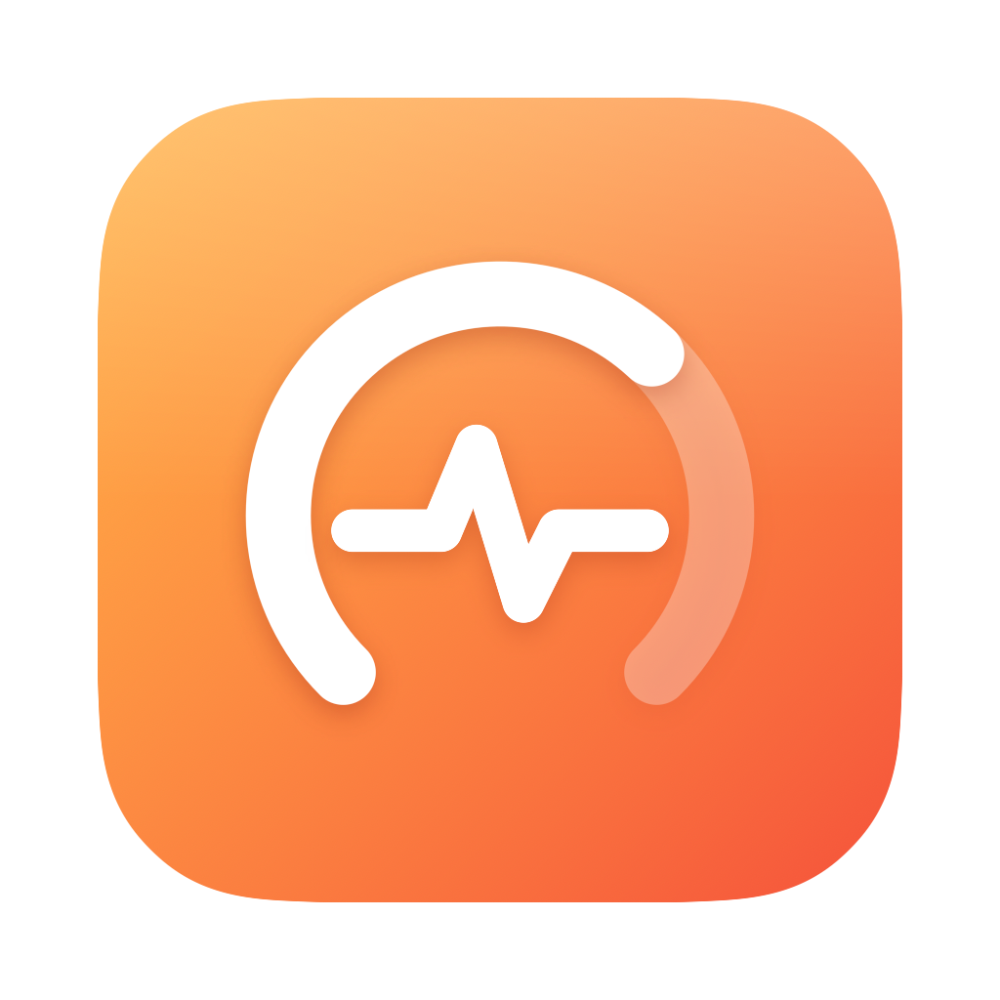

# Resource Tracker

A high-performance, native macOS system monitoring application designed with a stunning "liquid glass" visual aesthetic. Built entirely in Swift and SwiftUI, **Resource Tracker** consolidates real-time tracking of CPU, GPU, Memory, Disk IO, and Network activity into a clean, unified control center with a near-zero system footprint.

---

## ✨ Features

*   **🎛️ Unified Dashboard**: CPU, GPU, memory, and network in a Liquid Glass grid, each with a live 30-second history, under a plain-language status line ("Cruising smoothly.", or what needs attention).
*   **🧠 Honest Memory**: Leads with **memory pressure**, the kernel signal behind Activity Monitor's pressure graph, instead of "percent used" (macOS keeps RAM full on purpose). Includes a full breakdown: active, wired, compressed, free & cached, and swap.
*   **⚡ Top Processes**: The 50 busiest processes under your account, with app icons and names. Click a column header to sort by CPU or memory. EMA smoothing keeps rows from jumping around.
*   **🧩 Per-Core CPU**: Every core's load, plus the chip name and core count.
*   **💽 Disk & 🌐 Network**: Read/write and download/upload throughput with shared-scale history graphs. Disk capacity uses the same "available" figure Finder shows.
*   **🚀 Honest Speed Test**: Measures against Cloudflare's global network, not a server inside your ISP. Uses 6 download and 4 upload connections, discards the ramp-up, and reports *sustained* speed. Latency has server processing time subtracted and is measured again under load, with a bufferbloat grade. Uploads count only bytes the server confirms receiving. The result says whether your Wi-Fi/Ethernet link or your provider is the bottleneck, and flags networks that allow a short burst and then throttle.
*   **🛡️ Network Checks**: Finds what your network blocks or changes: captive portals, SSH/mail/Apple Push ports, UDP and HTTP/3 (QUIC), DNS-over-TLS, HTTPS inspection, NXDOMAIN hijacking, proxies, VPNs, IPv6, Low Data Mode, and multiple public IPs. Each result is explained in plain words.
*   **🌡️ Thermal State**: macOS's thermal pressure (Normal, Warm, Hot, Critical) shown in the header and factored into the status line.
*   **🛸 Menu Bar Summary**: CPU, memory, GPU, and network at a glance, with shortcuts to the dashboard and Settings.
*   **🔮 Floating HUD**: A tiny always-on-top readout that stays visible over full-screen apps and on every Space. Drag to move; right-click for options.
*   **⚙️ Settings**: Open at login (via `SMAppService`, kept in sync with System Settings) and the HUD toggle. The app also remembers which tab you left it on.

---

## ⚙️ Engineering & Performance

A monitor shouldn't cost what it measures. The work below took idle CPU on the dashboard from **~35% to ~2–5% of one core**. With the window hidden or the screen locked, the app publishes nothing to its views and uses **~0.6%** (down from 7.5%).

1.  **Light 1-Second Sampling**: One 1.0s timer, with tolerance so macOS can coalesce its wakeups with other apps', in `.common` run-loop mode so graphs stay live while you resize the window.
2.  **Precise Invalidation**: The view model is `@Observable` and assigns a property only when its value changes *at the precision it's displayed*. CPU moving from 12.31% to 12.34% re-renders nothing; throughput is published as its display string; badges are integers.
3.  **Visibility-Aware Publishing**: Each surface (dashboard, menu bar, HUD) reads its own values, and each set is published only while that surface is on screen. The dashboard tracks its window's real occlusion state, so when it's minimised, covered, closed, or on a locked screen, nothing it reads changes. History keeps recording and appears in one go when you come back.
4.  **Animations That Finish**: Gauges use a short `easeOut`, not a spring. A 0.7s spring never settles between 1s samples, so it kept the app rendering at display refresh rate forever. This was the single largest cost found in profiling. Bars also snap to visible steps and animate with `scaleEffect`, which is render-only and never triggers layout.
5.  **Native Sparklines**: A plain `Shape` (Catmull-Rom → cubic Bézier). For a 30-point line, the Swift Charts layout engine cost more than the rest of the card.
6.  **Off-Main-Thread Process Sampling**: The per-PID walk runs on a utility queue that owns all sampler state, with a generation counter so a sample still in flight when polling stops is discarded. Sampling runs only while the Processes tab is visible. Names and icons are resolved for the 50 visible rows, not all ~1,000 processes.
7.  **Correct on Apple Silicon**: `proc_taskinfo` CPU times are Mach ticks, not nanoseconds (125/3 ns per tick on Apple Silicon). They're converted through `mach_timebase_info`; read raw, a fully busy core shows as 2.4%. There's a regression test for this.
8.  **Robust Counters**: The kernel's 32-bit network byte counters are diffed per interface with wrap handling, so crossing 4 GB, or an interface reset, never produces a bogus spike. VPN tunnels and loopback are excluded to avoid double counting.
9.  **Measurement Honesty (Speed Test)**: Every speed-test method was checked against a real, shaped campus network, and each flaw found was fixed. Parallel requests on one `URLSession` share a single HTTP/2 connection and underestimate, so each stream gets its own session. Counting upload bytes as they enter socket buffers inflates results, so uploads count only server-confirmed deliveries, spread over each request's lifetime. Raw request timing roughly doubled latency, so Cloudflare's `Server-Timing` processing time is subtracted. The pure maths is unit-tested.
10. **Sandbox-Safe System Hooks**: Mach host statistics, `sysctl`, the IOKit registry (only the single property needed, not whole property tables), `getifaddrs`, and `proc_pidinfo`. Each was verified to work inside the App Sandbox.

### Project structure

```
src/
  ResourceTrackerApp.swift   Scenes: main window, HUD, menu bar extra, Settings
  MonitorViewModel.swift     Sampling loop and per-surface publishing
  *Monitor.swift             One sampler per subsystem (CPU, memory, GPU, disk, network, processes)
  SystemInfo.swift           Static facts: chip names, boot time, Mach timebase
  ContentView.swift          Main window: sidebar and every tab
  MenuBarView.swift          Menu bar summary
  HUDView.swift              Floating HUD and its visibility helper
  SettingsView.swift         Settings window
  Components.swift           Cards, sparkline, gauges, pills
  Theme.swift                Palette, animation, number formatting
  AppKitBridges.swift        Visual-effect background, window access, occlusion reader
  SpeedTest.swift            Speed test engine and its (unit-tested) measurement maths
  NetworkDiagnostics.swift   Network Checks: ports, protocols, DNS, HTTPS inspection, STUN
  NetworkLink.swift          Current connection and link rate (Ethernet, Wi-Fi via CoreWLAN)
  NetworkToolsView.swift     Speed Test and Network Checks cards
Tests/                       Unit and live-monitor tests (Swift Testing)
scripts/render_icon.swift    Draws the app icon and menu bar glyph at every size
install.sh                   Build Release and install to /Applications
docs/AppStore.md             Listing copy, keywords, review notes
PRIVACY.md                   Privacy policy (App Store privacy URL)
```

---

## 🛠️ Getting Started

### Prerequisites

*   macOS 26.0 (Tahoe) or higher — the UI is built on the system Liquid Glass APIs (`glassEffect`, `GlassEffectContainer`)
*   Xcode 26+ (or the matching Command Line Tools) with the macOS 26 SDK

### Install

```bash
./install.sh
```

Builds a Release copy, installs it to **/Applications** (replacing any older install), and launches it. Run it again whenever you pull or change code, so the app you open from Launchpad, Spotlight, or the Dock is always current.

### Build and Run (Xcode)

Open `ResourceTracker.xcodeproj` and press **Run** (⌘R). The project is App Sandbox–enabled and hardened, so what you run locally is exactly what ships. Run the tests with **⌘U**, or:

```bash
xcodebuild test -project ResourceTracker.xcodeproj -scheme ResourceTracker
```

A Debug build launched with `RT_TRACE=1` logs which values are published each second. Every published change re-renders the views that read it, so this is the quickest way to catch an idle-CPU regression.

The project file is generated from `project.yml` with [xcodegen](https://github.com/yonaskolb/XcodeGen); the `.xcodeproj` is committed, so you only need xcodegen if you edit `project.yml` (`xcodegen generate`).

### Quick dev build (no Xcode project)

A lightweight build script is also provided to compile, generate icons, and package the application natively from the command line.

1.  **Clone the repository**:
    ```bash
    git clone https://github.com/Hassan-Raza-Shaikh/Resource_Tracker.git
    cd Resource_Tracker
    ```

2.  **Run the Build Script**:
    ```bash
    ./build.sh
    ```

3.  **Launch the App**:
    The compiled bundle will be output to the `build` directory:
    ```bash
    open build/"Resource Tracker.app"
    ```

4.  **Install**: use `./install.sh` (above) rather than copying this dev build. It's unsandboxed and unsigned, so it isn't the build that ships.

---

## 🚀 Publishing to the Mac App Store

The app is fully App Store–ready: it runs under the **App Sandbox** with a minimal entitlement set (`ResourceTracker/ResourceTracker.entitlements` — `app-sandbox`, plus `network.client` for the on-demand Speed Test and Network Checks), has a hardened runtime, and every system read it performs (Mach host stats, IOKit registry, `getifaddrs`, `sysctl`, `proc_pidinfo`) has been verified to work inside the sandbox.

To ship it:

1.  Join the [Apple Developer Program](https://developer.apple.com/programs/).
2.  In Xcode, open **Signing & Capabilities** for the `ResourceTracker` target and select your **Team** (or set `DEVELOPMENT_TEAM` in `project.yml` and regenerate).
3.  Register the bundle ID `com.hassan.ResourceTracker` and create the app record in [App Store Connect](https://appstoreconnect.apple.com).
4.  **Product ▸ Archive**, then **Distribute App ▸ App Store Connect**.
5.  Fill in the listing. Every field is ready to paste in [`docs/AppStore.md`](docs/AppStore.md): subtitle, description, keywords, categories, review notes, and the privacy-policy URL ([`PRIVACY.md`](PRIVACY.md)). The privacy manifest (`ResourceTracker/PrivacyInfo.xcprivacy`) declares the app's only required-reason APIs: UserDefaults and disk capacity.

Bump `CFBundleVersion` in `Info.plist` for every upload.

> **Why there's no "Quit process" button:** the App Sandbox forbids signalling other processes (`kill` returns `EPERM`), and there is no entitlement that permits it. Everything else survives the sandbox intact.

---

## 🎨 Visual Design

**Icon.** A gauge (how much of your Mac is in use) around a pulse (live), in white on a warm amber-to-coral gradient. It's drawn in code by `scripts/render_icon.swift` on the macOS icon grid (an 824 px continuous-corner body on a 1024 px canvas), with bolder strokes at 16–64 px and a matching vector template glyph for the menu bar. To change it, edit the script and run:

```bash
swiftc -O -o /tmp/render_icon scripts/render_icon.swift && /tmp/render_icon
```

Leveraging native macOS vibrancy effects (`VisualEffectView`), the interface blends seamlessly with your desktop wallpaper, supporting both Light and Dark mode appearances out-of-the-box. Custom styled gradients and custom geometry draw elements are applied to create a premium, state-of-the-art monitor hub.

---

## 📄 License

This project is licensed under the MIT License - see the LICENSE file for details.
